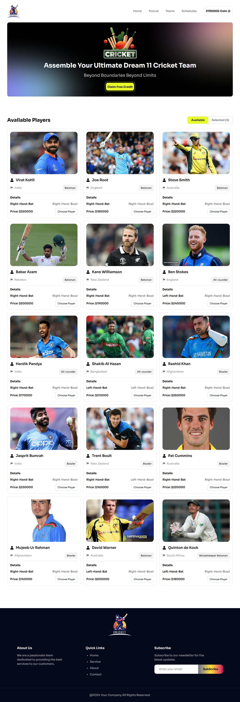
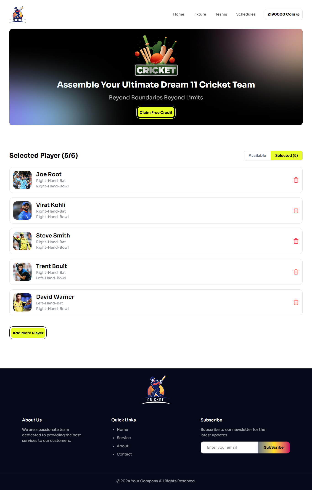

# 🏏 Dream 11 Cricket Team

**Assemble Your Ultimate Dream 11 Cricket Team**  
Beyond Boundaries, Beyond Limits!

## 📝 Project Description
Dream 11 Cricket Team is a web application that allows users to create their ultimate fantasy cricket team by selecting players from a list. Players are chosen based on available coins, and users can add or remove players. The app also includes dynamic coin management and interactive notifications to enhance the user experience.

## 🔗 Live Preview
### [Click here to visit the live site](https://dream-11-cricket-team-psi.vercel.app/)

## 📌 Key Features
- **Dynamic Coin Management**: Track your coins as you select or remove players from your team. Earn free credits and use them to buy players.
- **Player Details and Selection**: View detailed information about players, including their price, country, role, and batting/bowling hands. Choose players for your fantasy team with just a click.
- **Real-time Notifications**: Get immediate feedback with toast notifications when a player is successfully added, when there are insufficient coins, or when a player is already in your team.
- **Add/Remove Players**: Easily add players to your team and remove them if needed, with the ability to adjust your coin balance accordingly.

## 🖼️ Screenshots
### Homepage

### Selected Players Page

## 🚀 Tech Stack
- **Frontend**: React.js
- **Styling**: CSS (with custom styling)
- **State Management**: React Hooks (`useState`)
- **Icons**: `react-icons`
- **Notifications**: `react-toastify`